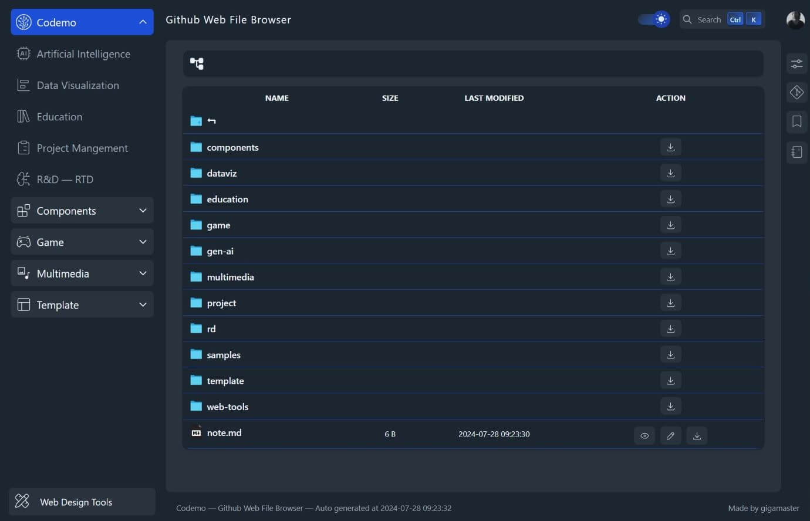

   

-----

<h1 align="center">
 
 
///// — CODEMO DIGITAL NOMAD — \\\\\
  
</h1>

GitHub repository with Web apps, code playground, vector graphic creator and editor,  
file browser to preview, edit and download individual files or a directory as a zip archive  
to a (local) computer.

  
--- 

<h2 align="center">
 
 
///// — WEB APPLICATIONS — \\\\\
  
</h2>

<table>
<tr><th width="30%">Web App</th><th>Description</th></tr>
<tr><td width=""></td><td></td></tr>
                | [dpaint][dpaint]  Image editor modeled after the legendary Deluxe Paint by Steffest  |
|                 | [drawio][drawio]  Diagram editor or whiteboard by JGraph Ltd and draw.io AG |
|                | [encrypt][encrypt]  Static HTML Encryption for public host |
|          | [erd-editor][erd-editor]  Entity-Relationship Diagram Editor by SeungHwan-Lee @dineug |
|                 | [godsvg][godsvg]  Editor for Scalable Vector Graphics (SVG) by @MewPurPur  |
|             | [grapesjs][grapesjs]  WYSIWYG eeb page builder |
|           | [livecodes][livecodes]  Live code playground |
|               | [mermaid-editor][mermaid]  Charts and diagrams editor |
|                  | [tldraw][tldraw]  Canvas and whiteboard draw |
|    | [voxel-builder][voxel-builder]  Voxel-based 3D Modeling Application  nimadez |
|               | [vvvebjs][vvvebjs]  Drag and drop web page builder givanz|

## Install on desktops and laptops

You must be using a modern browser. Desktop installation is currently supported by Google Chrome and Microsoft Edge on Linux, Windows, macOS, and Chromebooks. Click the button in the Address bar to get a pop up asking to install Codemo. Once Codemo is installed, it will:

- Have an icon in the launcher, home screen, start menu, or launchpad.
- Appear as a result when a user searches for the app on their device.
- Have a separate window within the operating system.
- Have support for specific capabilities.

**Install, manage, or uninstall apps...**  
- [Chrome - Use web apps](https://support.google.com/chrome/answer/9658361?hl=en&co=GENIE.Platform%3DDesktop)
- [Microsoft Edge](https://support.microsoft.com/en-us/topic/install-manage-or-uninstall-apps-in-microsoft-edge-0c156575-a94a-45e4-a54f-3a84846f6113)

### 1. Live Code

import a repository, directory, file or gist and embed a live code editor in a website with a simple link to see the results in real time. You can use your favorite CSS and Javascript framework with an existing project or start fresh with a quick-start template of [Livecodes](https://gigamaster.github.io/livecodes/)  

### 2. Github.dev web-based editor

You can also open any folder and use the github.dev web-based editor to edit files and commit your changes. Note that you must be signed in to GitHub.com to use the github.dev editor.

On [Codemo](https://gigamaster.github.io/codemo/), navigate to a directory of the repository.   

Click edit to open the file, then, in the same browser tab, press `.` 

Alternativaly, you can open the repository in a new browser tab, press `>`

- Change the URL from "github.com" to "github.dev".
- When viewing a file, select the  dropdown menu and click github.dev.

--- 

### Tech Stack

- [Docker](https://www.docker.com/) 
- Runner `ubuntu-latest` 
- [Python 3.11-alpine3.17](https://www.python.org/)  
- [GitHub Action Checkout](https://github.com/actions/checkout)
- [GitHub Action Pages Directory Listing](https://github.com/jayanta525/github-pages-directory-listing)
- [GitHub Action Upload Pages Artifact](https://github.com/actions/upload-pages-artifact)
- [GitHub Action Deploy Pages](https://github.com/actions/deploy-pages)
- [GitHub REST API](https://docs.github.com/en/rest?apiVersion=2022-11-28)

### Frontend 

- [Alpine.js](https://alpinejs.dev)   
  A rugged, minimal framework for composing behavior directly in your markup
- [Tailwind CSS](https://tailwindcss.com/)   
  A utility-first CSS framework
   
---

  > 
  > _If I had to do it again today, I would definitely choose the ease of use of jQuery over Tailwind and Alpine.js_
  >

--- 

### License

MIT License

Copyright (c) 2024

Permission is hereby granted, free of charge, to any person obtaining a copy   
of this software and associated documentation files (the "Software"), to deal   
in the Software without restriction, including without limitation the rights   
to use, copy, modify, merge, publish, distribute, sublicense, and/or sell   
copies of the Software, and to permit persons to whom the Software is   
furnished to do so, subject to the following conditions:   
   
The above copyright notice and this permission notice shall be included in all   
copies or substantial portions of the Software.   

THE SOFTWARE IS PROVIDED "AS IS", WITHOUT WARRANTY OF ANY KIND, EXPRESS OR   
IMPLIED, INCLUDING BUT NOT LIMITED TO THE WARRANTIES OF MERCHANTABILITY,   
FITNESS FOR A PARTICULAR PURPOSE AND NONINFRINGEMENT. IN NO EVENT SHALL THE   
AUTHORS OR COPYRIGHT HOLDERS BE LIABLE FOR ANY CLAIM, DAMAGES OR OTHER   
LIABILITY, WHETHER IN AN ACTION OF CONTRACT, TORT OR OTHERWISE, ARISING FROM,   
OUT OF OR IN CONNECTION WITH THE SOFTWARE OR THE USE OR OTHER DEALINGS IN THE   
SOFTWARE.   

[web]: https://gigamaster.github.io/codemo/web-app/
[dpaint-img]: ./app/web-app/dpaint.webp
[dpaint]: https://gigamaster.github.io/codemo/web-app/dpaint/
[drawio-img]: ./app/web-app/drawio.webp
[drawio]: https://gigamaster.github.io/codemo/web-app/drawio/
[encrypt-img]: ./app/web-app/encrypt.webp
[encrypt]: https://gigamaster.github.io/codemo/web-app/encrypt/
[erd-editor-img]: ./app/web-app/erd-editor.webp
[erd-editor]: https://gigamaster.github.io/codemo/web-app/erd-editor/
[godsvg-img]: ./app/web-app/godsvg.webp
[godsvg]: https://gigamaster.github.io/codemo/web-app/godsvg/
[grapesjs-img]: ./app/web-app/grapesjs.webp
[grapesjs]: https://gigamaster.github.io/codemo/web-app/grapesjs/
[livecodes-img]: ./app/web-app/livecodes.webp
[livecodes]: https://gigamaster.github.io/codemo/web-app/livecodes/
[mermaid-img]: ./app/web-app/mermaid-editor.webp
[mermaid]: https://gigamaster.github.io/codemo/web-app/mermaid-editor/
[tldraw-img]: ./app/web-app/tldraw.webp
[tldraw]: https://gigamaster.github.io/codemo/web-app/tldraw/
[voxel-builder-img]: ./app/web-app/voxel-builder.webp
[voxel-builder]: https://gigamaster.github.io/codemo/web-app/voxel-builder/
[vvvebjs-img]: ./app/web-app/vvvebjs.webp
[vvvebjs]: https://gigamaster.github.io/codemo/web-app/vvvebjs/
