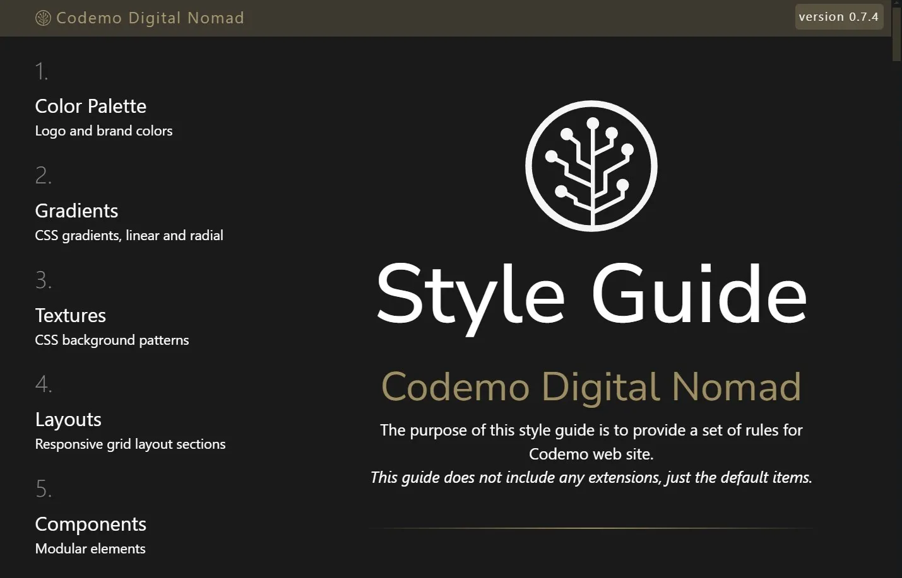

  
  
  

<h2 align="center">
 
///// — CODEMO DIGITAL NOMAD — \\\\\
  
</h1>

Codemo Digital Nomad Style Guide   
The purpose of this style guide is to provide a set of rules for website.

--- 
  

  
--- 

<h2 align="center">
 
 
///// — Style Guide — \\\\\
  
</h2>

### Color Palette
Logo and brand colors

| | `square` | `round` | `circle` | | `square` | `round` | `circle` |
|:--:|:--:|:--:|:--:|:--:|:--:|:--:|:--:|
|`#9e8e61`||||`#3e6598`||||
|`#2f4d74`||||`#213550`||||
|`#121d2b`||||`#f1f1f1`||||

### Gradients
CSS gradients, linear and radial

### Textures
CSS background patterns

### Layouts
Responsive grid layout sections

### Components
Modular elements

### Iconography
Scalable vectors Icons

### Typography
Fonts
HTML Text Formatting
Highlight source code

### Form elements
Forms and control elements

> [!NOTE]
> Highlights information that users should take into account, even when skimming.

> [!TIP]
> Optional information to help a user be more successful.

> [!IMPORTANT]
> Crucial information necessary for users to succeed.

> [!WARNING]
> Critical content demanding immediate user attention due to potential risks.

> [!CAUTION]
> Negative potential consequences of an action.

---

### License

MIT License

Copyright (c) 2024

Permission is hereby granted, free of charge, to any person obtaining a copy   
of this software and associated documentation files (the "Software"), to deal   
in the Software without restriction, including without limitation the rights   
to use, copy, modify, merge, publish, distribute, sublicense, and/or sell   
copies of the Software, and to permit persons to whom the Software is   
furnished to do so, subject to the following conditions:   
   
The above copyright notice and this permission notice shall be included in all   
copies or substantial portions of the Software.   

THE SOFTWARE IS PROVIDED "AS IS", WITHOUT WARRANTY OF ANY KIND, EXPRESS OR   
IMPLIED, INCLUDING BUT NOT LIMITED TO THE WARRANTIES OF MERCHANTABILITY,   
FITNESS FOR A PARTICULAR PURPOSE AND NONINFRINGEMENT. IN NO EVENT SHALL THE   
AUTHORS OR COPYRIGHT HOLDERS BE LIABLE FOR ANY CLAIM, DAMAGES OR OTHER   
LIABILITY, WHETHER IN AN ACTION OF CONTRACT, TORT OR OTHERWISE, ARISING FROM,   
OUT OF OR IN CONNECTION WITH THE SOFTWARE OR THE USE OR OTHER DEALINGS IN THE   
SOFTWARE.   

[web]: https://gigamaster.github.io/codemo/web-app/
[dpaint]: https://gigamaster.github.io/codemo/web-app/dpaint/
[drawio]: https://gigamaster.github.io/codemo/web-app/drawio/
